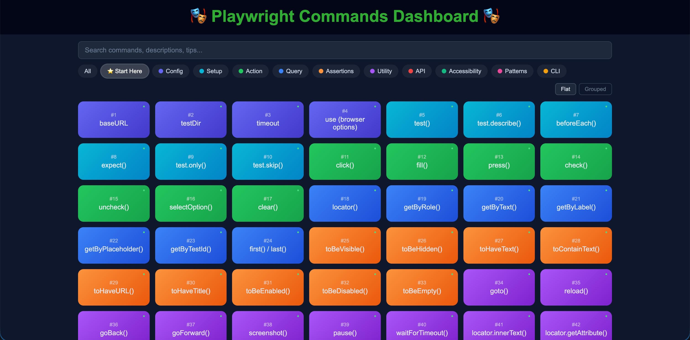
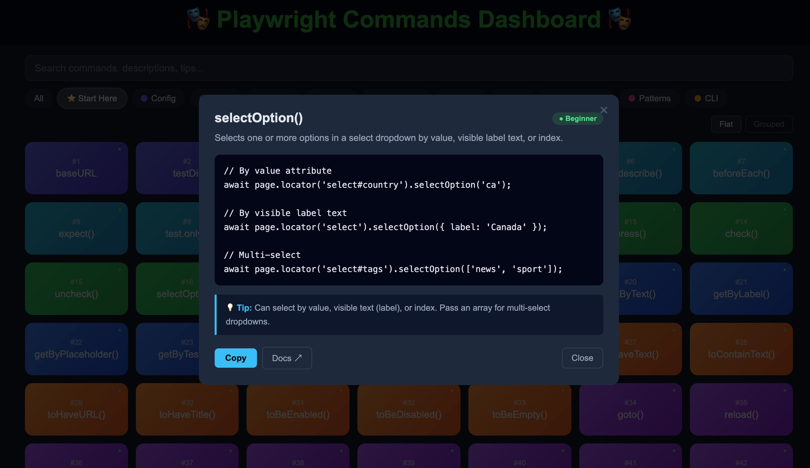

# 🎭 VitalHub Playwright Commands Dashboard

> All commands verified against the [Playwright 1.59](https://playwright.dev/docs/release-notes) release version.

An interactive reference dashboard for Playwright test automation, designed for beginners and experienced testers alike. Built with plain HTML, CSS, and JavaScript 





---

## Features

### Command Tiles
- Every Playwright command is displayed as a clickable tile
- Each tile shows a **difficulty indicator** in the corner:
  - `🟢 Green`   - Beginner
  - `🟠 Orange`  - Intermediate
  - `🟣 Purple`  - Advanced

### Command Modal
Clicking any tile opens a detailed modal containing:
- **Plain-English description** - what the command does, in simple terms
- **Code example** - ready-to-use snippet
- **Difficulty badge** - colour coded level indicator
- **Docs ↗ link** - direct link to the official Playwright documentation page
- **Copy button** - copies the code snippet to clipboard with visual confirmation
- Press **Escape** or click outside the modal to close it

### Filter Tabs
Filter the grid by category using the pill buttons at the top:

| Filter | Description |
|---|---|
| All | Shows every command |
| ⭐ Start Here | Shows beginner level commands for the best starting point |
| Config | playwright.config.ts options for runner, browsers, and CI |
| Setup | Test structure commands |
| Action | User interaction methods |
| Query | Element selector methods |
| Assertions | Expectation and assertion methods |
| Utility | Navigation, debugging, and page utilities |
| API | HTTP request and network interception methods |
| Accessibility | ARIA assertions, keyboard testing, and axe integration |
| Patterns | Full multi-step test examples |
| CLI | Terminal commands for running and managing tests |

### View Modes
Toggle between two layouts using the **Flat** / **Grouped** buttons:
- **Flat** - all commands in a single grid (default)
- **Grouped** - commands organised under their category headers

### Search
The search bar filters across:
- Command name
- Plain-English description
- Tip text
- Code content

---

## Categories

### Config (Indigo)
Key `playwright.config.ts` options for configuring the test runner, browsers, and CI pipelines.

| Option | Level |
|---|---|
| `baseURL` | Beginner |
| `testDir` | Beginner |
| `timeout` | Beginner |
| `use (browser options)` | Beginner |
| `retries` | Intermediate |
| `workers` | Intermediate |
| `fullyParallel` | Intermediate |
| `projects` | Intermediate |
| `reporter` | Intermediate |
| `trace` | Intermediate |
| `screenshot / video` | Intermediate |
| `forbidOnly` | Intermediate |
| `testIdAttribute` | Intermediate |
| `globalSetup / globalTeardown` | Advanced |

### Setup (Cyan)
The building blocks every Playwright test file needs.

| Command | Level |
|---|---|
| `test()` | Beginner |
| `test.describe()` | Beginner |
| `beforeEach()` | Beginner |
| `afterEach()` | Intermediate |
| `beforeAll()` | Intermediate |
| `afterAll()` | Intermediate |
| `expect()` | Beginner |
| `test.only()` | Beginner |
| `test.skip()` | Beginner |
| `test.fixme()` | Intermediate |
| `test.slow()` | Intermediate |
| `test.step()` | Intermediate |

### Query (Blue)
Methods for finding elements on the page.

| Command | Level |
|---|---|
| `locator()` | Beginner |
| `getByRole()` | Beginner |
| `getByText()` | Beginner |
| `getByLabel()` | Beginner |
| `getByPlaceholder()` | Beginner |
| `getByTestId()` | Beginner |
| `getByAltText()` | Intermediate |
| `getByTitle()` | Intermediate |
| `frameLocator()` | Advanced |
| `nth()` | Intermediate |
| `filter()` | Intermediate |
| `first() / last()` | Beginner |
| `and()` | Intermediate |
| `or()` | Intermediate |

### Action (Green)
Methods for interacting with elements.

| Command | Level |
|---|---|
| `click()` | Beginner |
| `fill()` | Beginner |
| `press()` | Beginner |
| `check()` | Beginner |
| `uncheck()` | Beginner |
| `selectOption()` | Beginner |
| `clear()` | Beginner |
| `hover()` | Intermediate |
| `dblclick()` | Intermediate |
| `pressSequentially()` | Intermediate |
| `setInputFiles()` | Intermediate |
| `scrollIntoView()` | Intermediate |
| `keyboard.press()` | Intermediate |
| `tap()` | Intermediate |
| `focus()` | Intermediate |
| `dragTo()` | Advanced |
| `dispatchEvent()` | Advanced |

### Assertions (Orange)
Methods for verifying expected state.

| Command | Level |
|---|---|
| `toBeVisible()` | Beginner |
| `toBeHidden()` | Beginner |
| `toHaveText()` | Beginner |
| `toContainText()` | Beginner |
| `toHaveURL()` | Beginner |
| `toHaveTitle()` | Beginner |
| `toBeEnabled()` | Beginner |
| `toBeDisabled()` | Beginner |
| `toBeEmpty()` | Beginner |
| `toBeChecked()` | Intermediate |
| `toHaveValue()` | Intermediate |
| `toHaveCount()` | Intermediate |
| `toHaveAttribute()` | Intermediate |
| `toHaveClass()` | Intermediate |
| `toContainClass()` | Intermediate |
| `toHaveCSS()` | Intermediate |
| `toBeEditable()` | Intermediate |
| `toBeInViewport()` | Intermediate |
| `expect.soft()` | Intermediate |
| `toHaveScreenshot()` | Advanced |
| `expect.poll()` | Advanced |

### Utility (Purple)
Navigation, debugging, and page control methods.

| Command | Level |
|---|---|
| `goto()` | Beginner |
| `reload()` | Beginner |
| `goBack()` | Beginner |
| `goForward()` | Beginner |
| `screenshot()` | Beginner |
| `pause()` | Beginner |
| `waitForTimeout()` | Beginner |
| `locator.innerText()` | Beginner |
| `locator.getAttribute()` | Beginner |
| `locator.count()` | Beginner |
| `waitForSelector()` | Intermediate |
| `waitForLoadState()` | Intermediate |
| `waitForURL()` | Intermediate |
| `on(console)` | Intermediate |
| `locator.isVisible()` | Intermediate |
| `page.setViewportSize()` | Intermediate |
| `evaluate()` | Advanced |
| `addInitScript()` | Advanced |
| `waitForFunction()` | Advanced |

### API (Red)
HTTP requests and network interception.

| Command | Level |
|---|---|
| `request.get()` | Beginner |
| `request.post()` | Beginner |
| `request.put()` | Intermediate |
| `request.patch()` | Intermediate |
| `request.delete()` | Intermediate |
| `route()` | Intermediate |
| `waitForResponse()` | Intermediate |
| `waitForRequest()` | Intermediate |
| `page.unroute()` | Intermediate |
| `route.abort()` | Advanced |
| `route.continue()` | Advanced |
| `route.fetch()` | Advanced |

### Patterns (Pink)
Complete multi-step test examples showing how commands work together.

| Pattern | Level |
|---|---|
| Login flow | Beginner |
| Form submit | Beginner |
| Wait for API | Intermediate |
| Mock API | Intermediate |
| File upload | Intermediate |
| API login setup | Intermediate |
| Page Object Model | Intermediate |
| storageState auth | Intermediate |

### CLI (Amber)
Terminal commands for running, debugging, and managing Playwright from the command line.

| Command | Level |
|---|---|
| `npx playwright test` | Beginner |
| `test <file>` | Beginner |
| `-g "name"` | Beginner |
| `--headed` | Beginner |
| `--debug` | Beginner |
| `--ui` | Beginner |
| `show-report` | Beginner |
| `codegen` | Beginner |
| `install` | Beginner |
| `install --with-deps` | Beginner |
| `--version` | Beginner |
| `--help` | Beginner |
| `--list` | Beginner |
| `--last-failed` | Intermediate |
| `--project` | Intermediate |
| `--workers` | Intermediate |
| `--retries` | Intermediate |
| `--timeout` | Intermediate |
| `--reporter` | Intermediate |
| `show-trace` | Intermediate |
| `--trace` | Intermediate |
| `--grep` | Intermediate |
| `--forbid-only` | Intermediate |
| `--shard` | Advanced |

### Accessibility (Teal)
Assertions and patterns for testing screen reader support, ARIA structure, and keyboard accessibility.

| Command | Level |
|---|---|
| `toMatchAriaSnapshot()` | Intermediate |
| `toHaveAccessibleName()` | Intermediate |
| `toHaveAccessibleDescription()` | Intermediate |
| `toHaveAccessibleErrorMessage()` | Intermediate |
| `toHaveRole()` | Intermediate |
| `locator.ariaSnapshot()` | Advanced |
| Keyboard navigation | Intermediate |
| Axe integration | Advanced |

---

## How to Use

1. Open [playwright commands cheat sheet](https://youvegotnigel.github.io/playwright-commands-cheat-sheet/) in your browser
2. Use **⭐ Start Here** to see beginner commands if you are new to Playwright
3. Click any tile to see the full description, code example, and tip
4. Use the **search bar** to find commands by name, description, or keyword
5. Use the **category filter tabs** to focus on one area at a time
6. Toggle **Grouped** view to see commands organised under their category headers
7. Click **Docs ↗** in the modal to open the official Playwright documentation

---

## Project Structure

```
playwright-commands-cheat-sheet/
├── images/          # Images folder
├── js/
│   ├── data.js      # All commands, descriptions, tips, and docs links
│   └── app.js       # UI logic - rendering, filtering, modal, search
├── index.html       # HTML shell - layout and modal structure only
└── LICENSE
└── readme.md
├── style.css        # All CSS styles
└── .gitignore
```

### Adding a New Command

Open [js/data.js](js/data.js), find the relevant category section, and add a new object to its `items` array:

```javascript
{
  name:  'commandName()',
  level: 'beginner',        // 'beginner' | 'intermediate' | 'advanced'
  desc:  'Plain-English explanation of what it does.',
  tip:   'When to use it, gotchas, or alternatives.',
  docs:  'https://playwright.dev/docs/...',
  code:  `await page.commandName();`
},
```

### Adding a New Category

In [js/data.js](js/data.js), add a new object to the `categories` array:

```javascript
{
  cat:   'CategoryName',
  cls:   'category-css-class',
  color: '#hexcolor',
  items: [ /* commands go here */ ]
},
```

Then add the corresponding CSS class in [style.css](style.css):

```css
.category-css-class {
  background: linear-gradient(135deg, #color1, #color2);
}
```

---

## Author
* **Nigel Mulholland** - [Linkedin](https://www.linkedin.com/in/nigel-mulholland/) 